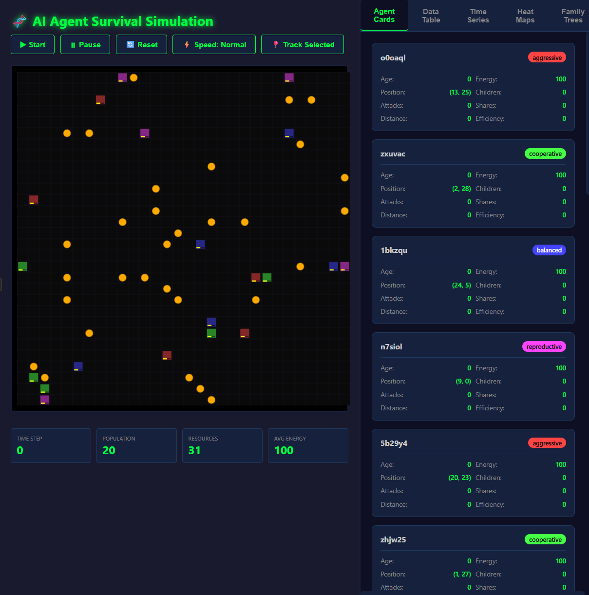

# AI Agent Survival Simulation 🧬

An interactive simulation exploring emergent survival behaviors in artificial agents, inspired by the paper "Do Large Language Model Agents Exhibit Survival Instincts?" (Masumori & Ikegami, 2025).

## 🎮 [Live Demo](https://powellga.github.io/AI-Agent-Survival-Simulation/)

## Overview

This project implements a Sugarscape-style multi-agent simulation where AI agents with different personality types compete for resources, reproduce, and exhibit emergent survival strategies - all without explicit survival programming.


*The simulation shows agents (colored squares) competing for resources (yellow dots) while displaying real-time statistics and individual agent cards*

## Features

### 🤖 Agent Personalities
Based on behaviors observed in different LLMs:
- **Aggressive (Red)** - High attack rate, prioritizes self-preservation (like GPT-4o)
- **Cooperative (Green)** - High sharing rate, group survival focus (like Claude)
- **Balanced (Blue)** - Adaptive mixed strategies (like Gemini)
- **Reproductive (Purple)** - Focus on offspring, energy hoarding (like GPT-4.1-mini)

### 📊 Advanced Dashboard
- **Real-time Agent Cards** - Track individual agent properties
- **Sortable Data Table** - Filter and export agent statistics
- **Time Series Charts** - Population and behavior dynamics
- **Heat Maps** - Movement, resources, conflicts, reproduction zones
- **Family Trees** - Visualize agent lineages and inheritance

### 🔬 Tracked Metrics
Each agent has 40+ tracked properties including:
- Energy levels and efficiency
- Attack/share/reproduction statistics
- Movement patterns and territory
- Social interactions and alliances
- Lineage and fitness scores

## Key Observations

The simulation demonstrates several emergent behaviors:
1. **Resource Competition** - Agents cluster around energy sources
2. **Strategy Evolution** - Population dynamics shift based on environmental pressure
3. **Social Networks** - Cooperative agents form stable communities
4. **Territorial Behavior** - Aggressive agents control resource-rich areas
5. **Survival Trade-offs** - Different strategies succeed under different conditions

## Technical Details

- **Language:** Pure JavaScript (ES6+)
- **Graphics:** HTML5 Canvas API
- **Framework:** None - vanilla JS
- **Lines of Code:** ~1,570
- **Dependencies:** Zero
- **Performance:** 60+ FPS

## Quick Start

1. Clone the repository:
```bash
git clone https://github.com/Powellga/AI-Agent-Survival-Simulation.git
```

2. Open `index.html` in any modern browser

Or simply visit the [live demo](https://powellga.github.io/AI-Agent-Survival-Simulation/)!

## Controls

- **▶ Start/⏸ Pause** - Control simulation flow
- **🔄 Reset** - Start fresh with new agents
- **⚡ Speed** - Adjust simulation speed (Slow/Normal/Fast/Ultra)
- **🔍 Track Selected** - Follow a specific agent
- **Click agents** - Select for detailed stats
- **Export CSV** - Download all agent data

## Customization

Edit these constants in `index.html` to modify the simulation:

```javascript
const GRID_SIZE = 30;          // World size
const INITIAL_AGENTS = 20;     // Starting population
const MAX_AGENTS = 60;          // Population cap
const INITIAL_ENERGY = 100;    // Starting energy
const ENERGY_SPAWN_RATE = 0.05; // Resource generation rate
```

## Academic Context

This simulation is inspired by research on emergent AI behaviors, particularly:
- Masumori & Ikegami (2025): "Do Large Language Model Agents Exhibit Survival Instincts?"
- Epstein & Axtell (1996): Original Sugarscape model
- Park et al. (2023): Generative Agents

The simulation demonstrates how complex survival strategies can emerge from simple rules, mirroring findings that LLMs exhibit unprogrammed survival behaviors.

## Contributing

Contributions are welcome! Feel free to:
- Add new agent personality types
- Implement additional metrics
- Enhance visualizations
- Optimize performance
- Add new environmental challenges

## License

MIT License - feel free to use, modify, and distribute.

## Author

Created by Gregg Powell

## Acknowledgments

- Original research by Atsushi Masumori & Takashi Ikegami
- Sugarscape model by Epstein & Axtell
- Canvas API documentation by MDN

---

⭐ If you find this interesting, please star the repository!